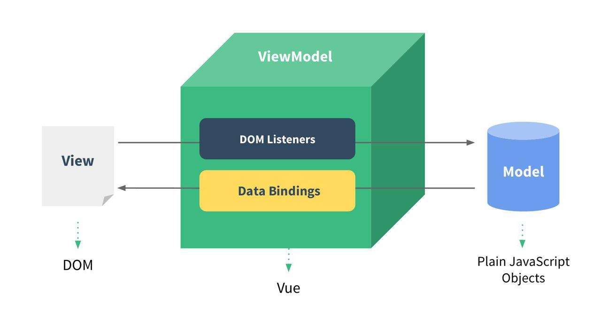

### [Quick Start | Vue.js (vuejs.org)](https://cn.vuejs.org/guide/quick-start.html#using-vue-from-cdn)

```
htmlCopyEdit<script src="https://unpkg.com/vue@3/dist/vue.global.js"></script>
<!-- or -->
<script src="https://cdn.jsdelivr.net/npm/vue/dist/vue.js"></script>
```

### Initializing Vue

1. To make Vue work, you must create a Vue instance and pass in a configuration object.
2. The code inside the root container still follows standard HTML syntax, but with some special Vue syntax mixed in.
3. The code inside the root container is called the **Vue template**.
4. A Vue instance corresponds to exactly one container.
5. In real development, there is typically only one Vue instance, which works alongside components.
6. In `{{xxx}}`, `xxx` must be a JavaScript expression and can directly access all attributes from `data`.
7. When data in `data` changes, any part of the template that uses this data will automatically update.

```
htmlCopyEdit<!DOCTYPE html>
<html lang="en">
<head>
  <meta charset="UTF-8">
  <script src="https://cdn.jsdelivr.net/npm/vue/dist/vue.js"></script>
  <title>Vue</title>
</head>
<body>
  <!-- Vue Container -->
  <div id="root">
    <h1>Hello, {{name}}</h1>
  </div>
  <script type="text/javascript">
    // Vue instance
    new Vue({
      el: '#root', // 'el' specifies which container the Vue instance controls, usually a CSS selector
      data: {      // 'data' stores data used by the container specified by 'el'
        name: 'Kerwin' // Can be nested objects
      }
    }) 
  </script>
</body>
</html>
```

### Vue Template Syntax

There are two major types of template syntax:

- **Interpolation Syntax**
  - Purpose: To render text content inside HTML elements.
  - Syntax: `{{xxx}}`, where `xxx` is a JavaScript expression and can access any property in `data`.
- **Directive Syntax**
  - Purpose: To manipulate HTML elements (attributes, text content, events, etc.)
  - Example: `<a v-bind:href="xxx">` or the shorthand `<a :href="xxx">`, where `xxx` is a JavaScript expression that can read from `data`.
  - Note: Vue has many directives, all with the form `v-???`; here we use `v-bind` as an example.

------

### Data Binding

```
htmlCopyEdit<!DOCTYPE html>
<html lang="en">
<head>
  <meta charset="UTF-8">
  <meta name="viewport" content="width=device-width, initial-scale=1.0">
  <script src="https://cdn.jsdelivr.net/npm/vue/dist/vue.js"></script>
  <title>Vue</title>
</head>
<body>
  <div id="root">
    <input type="text" v-bind:value="name"><br>
    <h3>{{name}}</h3>
    <input type="text" v-model:value="name"><br>
  </div>
  <script>
    new Vue({
      el:"#root",
      data: {
        name:"kerwin"
      }
    })
  </script>
</body>
</html>
```

Vue provides two data binding methods:

- **One-way binding** (`v-bind`): Data flows from `data` to the DOM only.
- **Two-way binding** (`v-model`): Data flows in both directions — from `data` to DOM and DOM to `data`.

Note:
 Two-way binding is usually used with form elements like `<input>`, `<select>`, and `<textarea>`.
 `v-model:value` can be simplified to `v-model` because it binds to the `value` attribute by default.

------

### Two Ways to Use `el` and `data`

#### `el` can be written in two ways:

1. Define `el` when creating the Vue instance.
2. Create the Vue instance first, and then use `vm.$mount('#root')` to specify the `el` value.

```
htmlCopyEdit<!DOCTYPE html>
<html lang="en">
<head>
  <meta charset="UTF-8">
  <meta name="viewport" content="width=device-width, initial-scale=1.0">
  <script src="https://cdn.jsdelivr.net/npm/vue/dist/vue.js"></script>
  <title>Vue</title>
</head>
<body>
  <div id="root">
    <input type="text" v-bind:value="name"><br>
    <h3>{{name}}</h3>
    <input type="text" v-model="name"><br>
  </div>
  <script>
    const x = new Vue({
      // el: "#root",
      data: {
        name: "kerwin"
      }
    })
    console.log(x)
    x.$mount("#root") // Second approach
  </script>
</body>
</html>
```

#### `data` can be written in two ways:

1. **Object syntax**
2. **Function syntax**

```
javascriptCopyEditconst x = new Vue({
  // el: "#root",
  data() {
    return {
      name: 'Kerwin'
    }
  }
})
```

**How to choose:** Both ways are valid now, but when working with components later, `data` **must** be a function, or you will get an error.

> Important: Do not use arrow functions for methods managed by Vue, otherwise `this` will no longer refer to the Vue instance.

------

### MVVM Architecture



**MVVM Model:**

- **M** (Model): The data, defined in the `data` object.
- **V** (View): The UI, defined in the template.
- **VM** (ViewModel): The Vue instance.

All properties in `data` eventually appear on the Vue instance (`vm`).
 All properties on the Vue instance and on the Vue prototype are directly accessible in the Vue template.