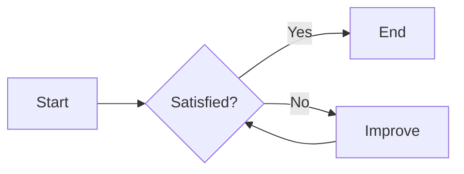

# Heading  
## Heading  
### Heading  
#### Heading  

**Bold**  
*Italic*  
***Bold Italic***  

---
~~Strikethrough~~  
<u>Underline</u>  

| Header    | Header    | Header    |
| --------- | --------- | --------- |
| Row1 Col1 | Row1 Col2 | Row1 Col3 |
| Row2 Col1 | Row2 Col2 | Row2 Col3 |
| Row3 Col1 | Row3 Col2 | Row3 Col3 |

$O(n^{2})$  
$\alpha, \beta, \gamma$  

$$
\vec{Y} =  
\begin{bmatrix}  
y_1 \\  
y_2 \\  
... \\  
y_n  
\end{bmatrix},  
\vec{X} = \begin{bmatrix}  
x_{11} ... x_{1p} \\  
... \\  
x_{n1} ... x_{np}  
\end{bmatrix},  
\vec{\beta} = \begin{bmatrix}  
\beta_0 \\  
\beta_1 \\  
... \\  
\beta_p  
\end{bmatrix}  
$$



Code:
```cpp
void solve() {  
    auto fib = [](auto && fib, int n) -> int {  
        if(n <= 2) return 1;  
        else return fib(fib, n - 1) + fib(fib, n - 2);  
    };  
    cout << fib(fib, 5);  
}  
```

